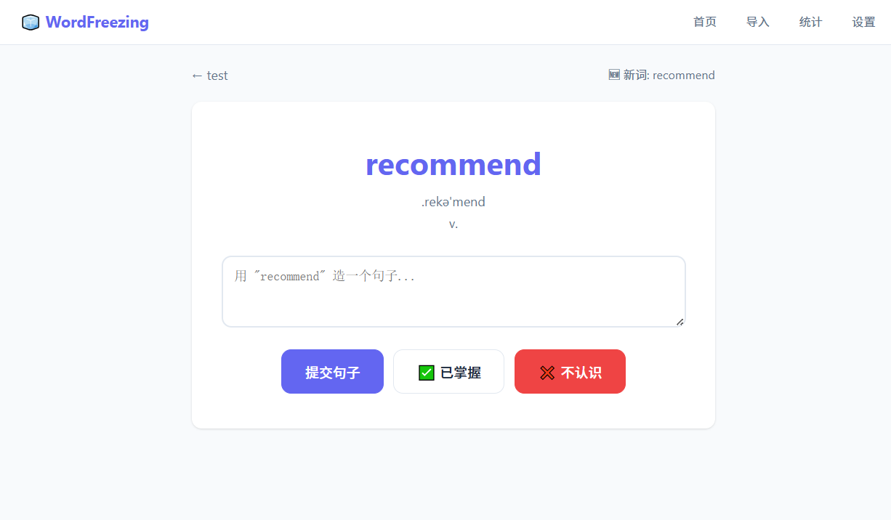
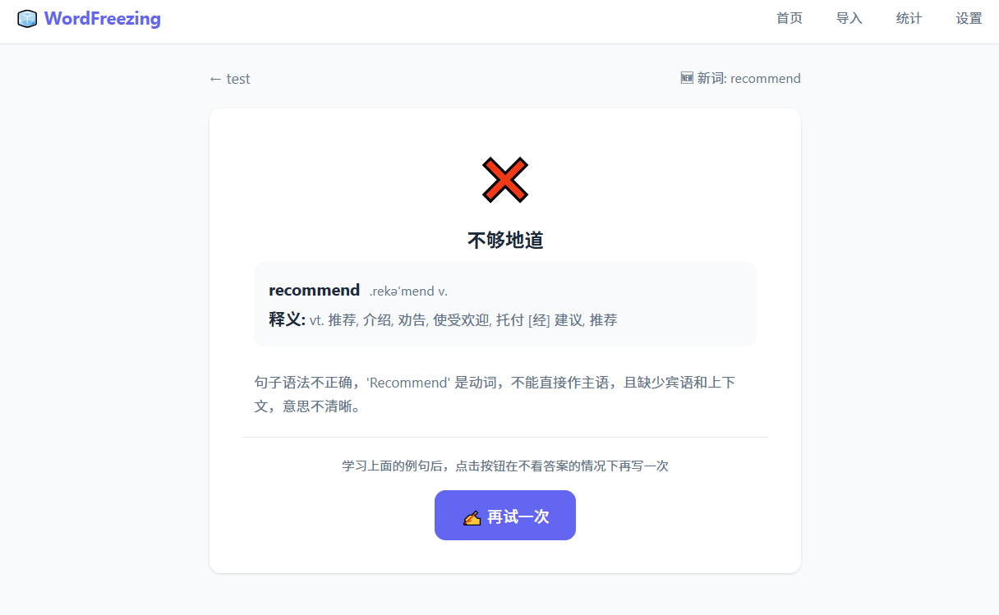
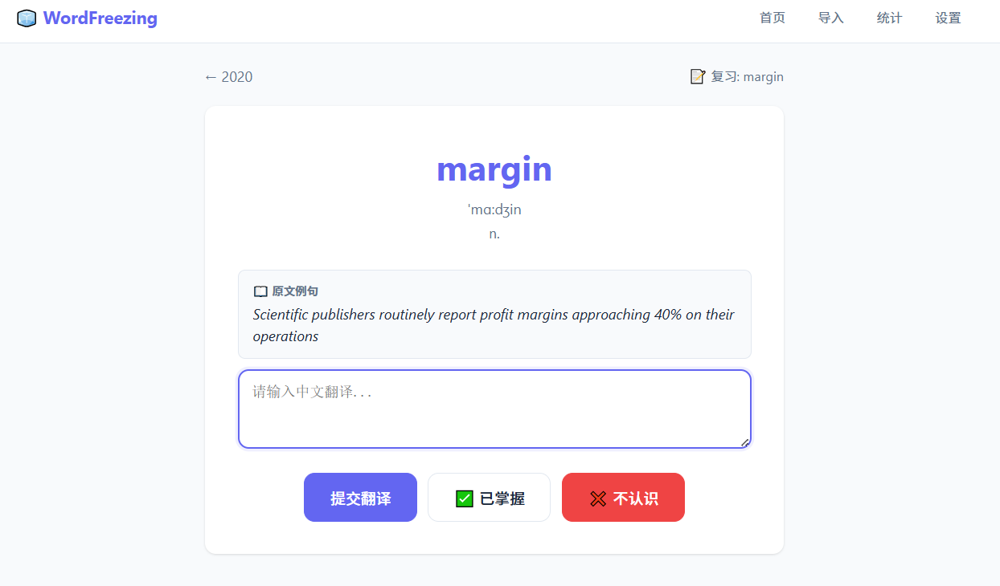
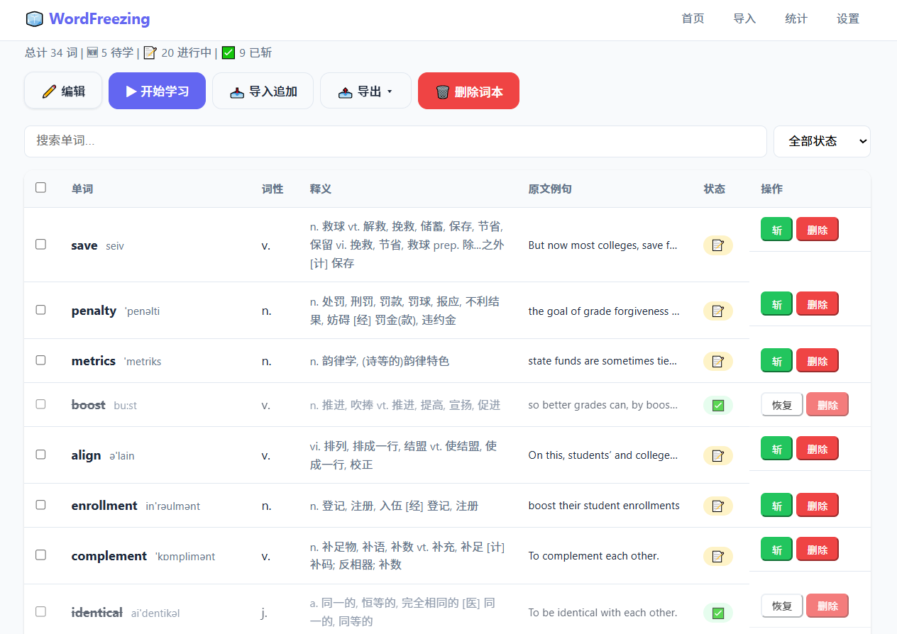

# 📖 WordFreezing — 在语境中真正掌握单词

> 不让你背单词，而是**让你用单词**。

背单词的终极问题：**记住了，却不会用。**

大多数背词软件只做到一步——给你「单词 + 汉译」，让你反复刷到眼熟。可离开 App，遇到这个词依然想不起意思，写作时更不敢用它。因为**「认识一个词」和「掌握一个词」是两回事**：掌握，意味着你了解它的用法、搭配和适用语境。

WordFreezing 换一个思路：不让你背单词，而是**让你用单词**。

- **✍️ 造句模式** — 给你一个单词，你用英文造一个句子，AI 评判你用得是否地道
- **🌍 翻译模式** — 给你一句英文原句，你翻译成中文，AI 评判你是否真正读懂

你在真实的语境中使用一个词，深刻理解它的用法与情景，才能真正掌握它。配合科学的**间隔重复**，让每个词在恰到好处的时刻再次出现——真正会用的词，才刻得进长期记忆。

> 后来，这套「动手实践」的学习理念也延伸到了**优秀作文的收藏阅读**上。

---

## 🧩 学习模块

### 📘 英语模块（核心）

区别于传统「看单词 → 记释义」的背词方式，通过 **AI 评判 + 间隔重复** 真正掌握单词用法：

- **造句模式**：展示单词（英文 + 音标 + 词性，隐藏释义例句）→ 用户造句 → AI 评判是否语法正确、用词地道
- **翻译模式**：展示单词 + 原文例句 → 用户写中文翻译 → AI 评判核心意思是否准确，始终给出参考翻译
- 评判**不通过**时：先展示单词释义 → 再给评判反馈（含目标单词正确用法示范）→ 最后例句，点击「✍️ 再试一次」**回到空白展示页**重新作答，看不到答案
- 支持 TXT / 手动导入词本（本地 ECDICT 词典零成本补全词性音标释义，未命中才调 AI）
- JSON / CSV 导出、全局统计、数据备份恢复

### 📖 作文本 — 优秀作文收藏阅读

- 手动上传优秀作文（标题 / 作者 / 正文 / 笔记），纯净排版舒适阅读
- 首行缩进、高行距，笔记独立展示

---

## 🧠 间隔重复算法

英语模块使用这套经过打磨的记忆调度逻辑，围绕「**失败立即退级，成功逐级推进**」：

```
new ── 首次通过 ──→ ✅ mastered（直接斩）
  ├─ 不通过 / 不认识 ──→ learning(stage 0) → 立即重试（看不到答案）
  │                          ├─ 通过 → stage 1（3 天后复习）
  │                          └─ 不通过 → 留在 stage 0（1 天后复习）
  │
learning(stage 0) → 通过 → stage 1（3 天）→ 通过 → stage 2（7 天）→ 通过 → ✅ mastered
任何 stage 失败 ──→ 退回 stage 0
同一天重复通过只计一次有效（防抖）
```

- 先复习今日到期单词，再学新词
- 通过次数连续记录，失败归零——**只有真正连续用对的词才会被「斩」**

---

## 🛠️ 技术栈

| 层 | 技术 |
|---|---|
| 后端 | Python 3.11 + Flask（Blueprint 多模块架构） |
| 数据库 | SQLite（WAL 模式 + 外键 + 自动建表/迁移） |
| 前端 | Jinja2 模板 + 原生 HTML/CSS/JS |
| AI 接口 | DeepSeek API（OpenAI 兼容格式） / 本地 Ollama |
| 本地词典 | ECDICT 开源词库（MIT 许可，零 API 成本） |

**关键设计**

- `services/ai_service.py` 统一抽象 DeepSeek / Ollama，提供 `call_ai` / `extract_json` 供各模块复用
- 本地词典命中即零成本补全词性/音标/释义，批量未命中才一次性 AI 补全（省 token）
- 评判提示词要求**不通过时必含目标单词的正确用法示范**，反馈即学习材料
- 单文件应用演进为按模块拆分的 Flask Blueprint 架构（`routes/english`、`routes/essay`）

---

## 🚀 快速开始

```bash
# 1. 安装依赖
pip install -r requirements.txt

# 2. 启动（首次运行自动建表）
python app.py
```

打开 **http://localhost:5000**，进入「设置」填入 DeepSeek API Key 即可开始使用。

**可选：本地词典**（强烈建议，可省掉大部分 API 调用）

把 [ECDICT](https://github.com/skywind3000/ECDICT) 同源的 `stardict.db`（约 812MB）放入 `dictionary/` 目录，系统自动检测使用；未命中时才调用 AI 补全。

**数据存储**：全部数据（词本、单词、配置、备份）保存在本地 SQLite，API Key 存于本地数据库，`*.db`、`.env` 均已加入 `.gitignore`，不会外泄。

---

## 📁 项目结构

```
WordFreezing/
├── app.py                    # Flask 入口（注册三个蓝图）
├── database/
│   └── schema.sql            # 全部 8 张表（IF NOT EXISTS，自动建表）
├── models/                   # 英语模块数据层（词本/单词/配置）
├── services/
│   ├── ai_service.py         # AI 评判 + 批量补全（DeepSeek/Ollama 抽象）
│   ├── import_service.py     # TXT/手动导入解析 + 本地词典查询
│   └── review_service.py     # 间隔重复算法
├── routes/
│   ├── english/              # 英语蓝图（18 条路由）
│   └── essay/                # 作文本蓝图（10 条路由）
├── templates/                # Jinja2 模板（按模块分目录）
├── static/
│   ├── css/                  # 各模块独立样式
│   └── js/                   # 学习页交互
├── dictionary/               # 本地词典（可选，自行下载）
└── requirements.txt
```

---

## 📸 界面预览

> 截图放在 `screenshots/` 目录下即可显示。

| 学习页（造句模式） | 评判反馈 |
| :---: | :---: |
|  |  |

| 学习页（翻译模式） | 词本总览 |
| :---: | :---: |
|  |  |

---

## 🗺️ Roadmap

- [ ] 单元测试（间隔重复算法）
- [ ] Docker 一键部署
- [ ] 英语模块：学习页预加载下一词、本地词典 L0 缓存
- [ ] 作文模块：搜索 / Markdown 渲染 / 高亮标注

---

## 📄 License

[MIT](LICENSE)，ECDICT 词典数据遵循其 MIT 许可。

---

*一个始于「背单词记不住」的个人项目。*
